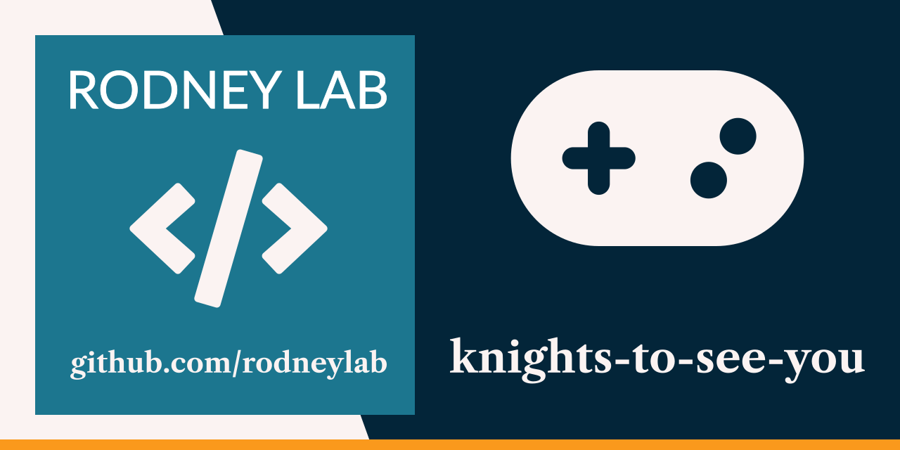

  

<h1 align="center">
  Knights to See You
</h1>

# knights-to-see-you

Godot Rust 2D Platform game, base on [Brackeys&rsquo; How to make a Video Game Godot Beginner Tutorial](https://www.youtube.com/watch?v=LOhfqjmasi0).

## Usage

Import `godot` folder in Godot Engine 4 edit to run.

## Issues

Feel free to jump into the
[Rodney Lab matrix chat room](https://matrix.to/#/%23rodney:matrix.org).
